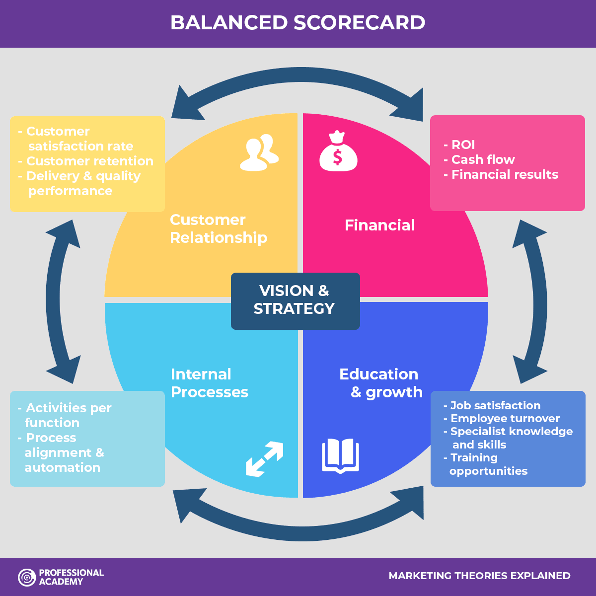

# UrbanEats

## Balanced Scorecard

1. **Customer Relationship:**
    - Customer satisfaction rate
    - Customer retention
    - Customer uptake
    - Restaurant uptake

2. **Financial:**
    - ROI (Return on Investment)
    - Better cash-flow 
    - Financial results (profit boom)
    - Higher turnover

3. **Internal Processes:**
    - Employees understanding new procedures/policies to implement the move into a new city
    - Automating the ordering process to handle larger quantities of orders simultaneously
    - New restaurants aware of the process

4. **Education & Growth:**
    - Job satisfaction
    - Lower employee turnover as results are being seen instantly
    - Opportunities to up-skill and develop internally 
    - Opportunities to relocate