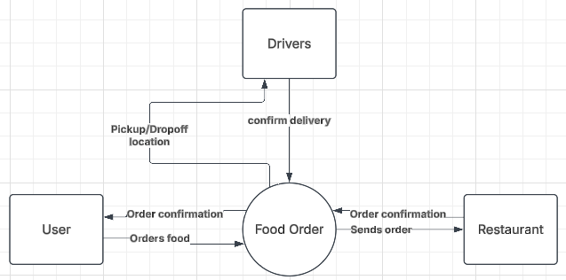
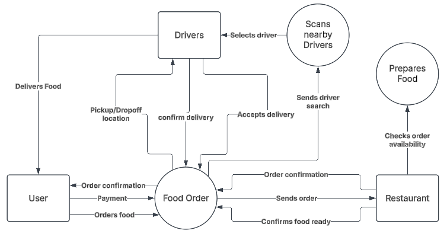
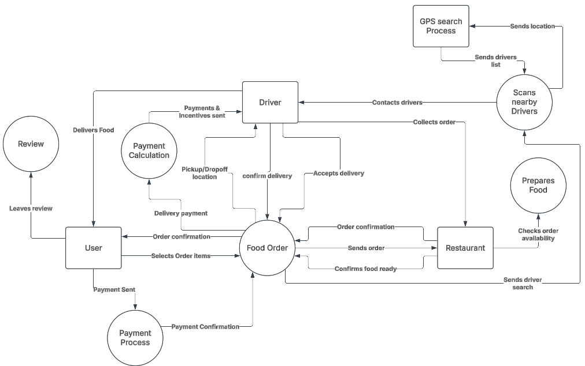

# UrbanEats

## Data Flow Diagram (DFD)

### Level 0 Diagram

This level 0 DFD shows the process of UrbanEats strategy at the highest level. This gives allows for a simplistic view of the major mechanisms in relation to external interactions. It also highlights the main stakeholders involved to making the service work.

### Level 1 Diagram

The above level 1 DFD shows a more detailed view of UrbanEats strategy. This would be useful for looking at how UrbanEats operate internally, to look at the areas needed to be managed.

### Level 2 Diagram

The Level 2 DFD further zooms into the major system. This breaks down the level 1 DFD into manageable processes within its diagram. Particularly best for looking at areas that may not be functioning well, or even areas of opportunity for the near future.