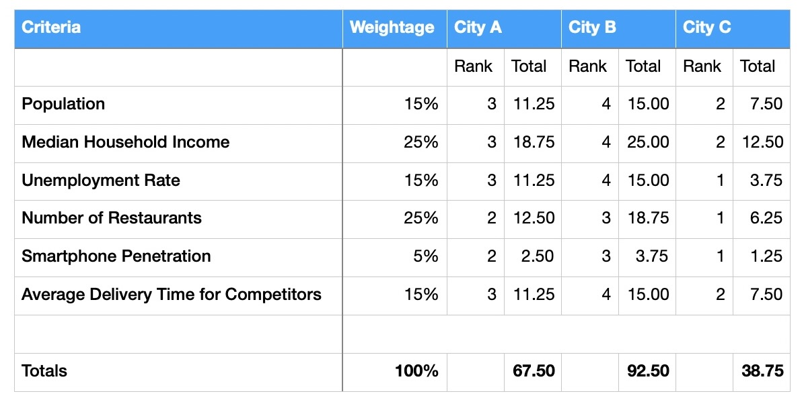

# UrbanEats

## Decision Matrix

We have identified that Median Household Income and Number of Restaurants to be the most imporant criteria for launching our product in a new city.

Smartphone penetration is of least importance since the majority of people who would order food would have access to a smartphone, but it is still a factor worth considering. 

Based on this, we have ranked each criteria out of 4 to give us the Total percentages and how that relates to the weightage given.

City B scores favourably in all categories so we would recommend opting to branch into City B.