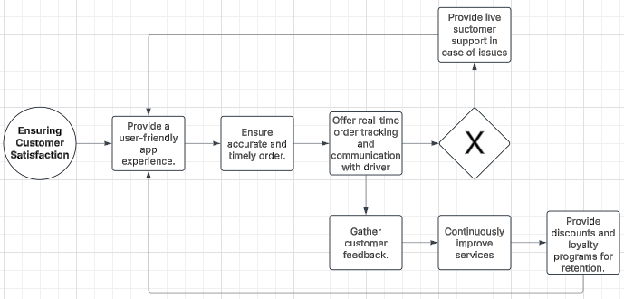

# UrbanEats

## Process Modelling

### Onboarding Restaurants

### Managing Orders

### Dispatching Drivers

### Ensuring Customer Satisfaction

The above product models allow for UrbanEats to follow to visualise their project for expansion. This aids in highlighting the different avenues and stakeholders that may need to be involved for the expansion to happen successfully. Restaurant onboarding, order management, dispatch of drivers and ensuring customer satisfaction are the four main pillars for UrbanEats to successfully expand in a new location whilst taking necessary steps to confirming a reputable business.