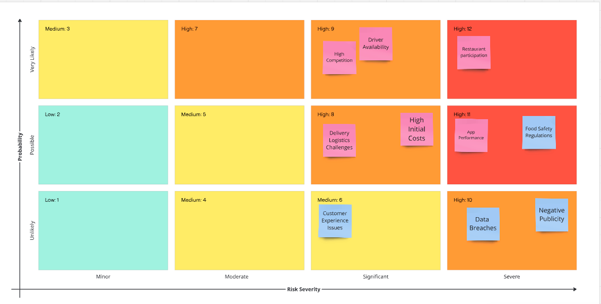

# UrbanEats

## Risk Assessment

### Risk Assessment Diagram

### Risk Assessment Mitigations

1. **High Competition:** Existing competitors may dominate the market.
    - Conduct thorough market research, differentiate services, and offer promotions to attract users.
2. **Driver Availability:** Shortage of drivers, high demand.
    - Offer competitive pay, incentives, and ensure fair treatment of drivers.
3. **Restaurant Participation:** Local restaurants may hesitate to join due to commission concerns.
    - Offer competitive commission rates, highlight benefits, and provide onboarding support.
4. **Delivery Logistic Challenges:** Ensuring timely deliveries in high populated and traffic-heavy areas.
    - Optimise delivery routes, use data analytics to check high-demand areas, and ensure an adequate driver supply.
5. **High Initial Cost:** Expansion involves significant upfront investment.
    - Develop a detailed financial plan, seek investor support, and optimise cost centres.
6. **App Performance:** System crashes or technical issues affecting user experience.
    - Regular app testing, quick bug fixes, and scalable infrastructure.
    